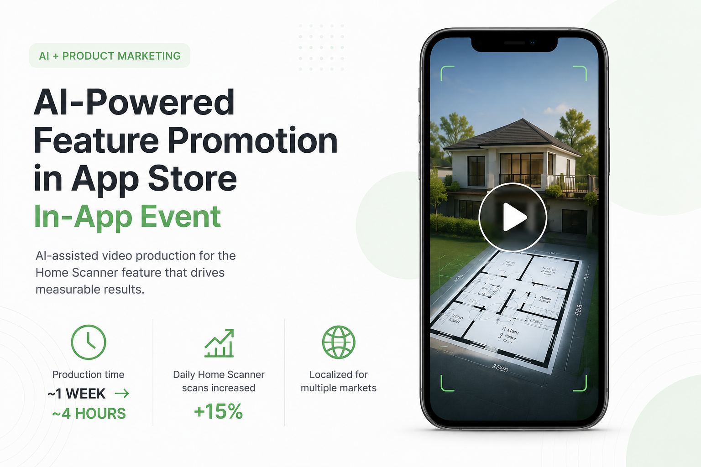

# 🚀 AI-Assisted Feature Promotion with App Store In-App Events

> End-to-end production of an App Store In-App Event campaign for the Home Scanner feature using AI-assisted video generation, reducing creative production time from **~1 week to ~4 hours** while increasing daily feature usage by **15%**.



---

## Overview

To increase adoption of the **Home Scanner** feature, I created an App Store In-App Event campaign centered around an AI-assisted promotional video.

Instead of following a traditional production process involving multiple stakeholders, I used **Wan** to generate the video, iterated through multiple versions to resolve generation issues, manually edited the final asset, and launched the campaign through App Store Connect.

The project demonstrates how AI can accelerate creative production while still requiring product thinking, creative direction, quality control, and marketing execution.

---

## Challenge

The objective was to create a compelling promotional video for an App Store In-App Event while significantly reducing production time.

AI video generation proved to be highly iterative. Throughout the process, I had to refine prompts and regenerate scenes to resolve common issues such as:

- inconsistent house geometry
- incorrect floor plan visualization
- unstable transitions
- unusable generated clips

The final video was assembled through manual editing after selecting the best AI-generated sequences.

---

## My Role

I owned the project end-to-end:

- Defined the creative concept for the feature promotion
- Generated the promotional video using **Wan**
- Refined prompts through multiple iterations
- Edited and assembled the final video
- Wrote and optimized App Store In-App Event metadata
- Localized the campaign for multiple markets
- Submitted the event for App Store editorial featuring

---

## AI Workflow

```text
Feature Promotion
        │
        ▼
Creative Concept
        │
        ▼
Wan Video Generation
        │
        ▼
Multiple Prompt Iterations
        │
        ▼
Manual Editing
        │
        ▼
App Store In-App Event
        │
        ▼
Feature Adoption
```

---

## Video

🎥 **Final promotional video**

`video/home-scanner-in-app-event.mp4`

---

## Results

- Reduced creative production time from **~1 week to ~4 hours**
- Increased daily Home Scanner usage by **15%**
- Localized the campaign for multiple markets
- Optimized App Store metadata for discoverability
- Submitted the campaign for App Store editorial featuring

---

## Tools

- Wan — AI video generation
- Video editing software — post-production
- App Store Connect — In-App Event management
- AI-assisted copywriting
- Localization workflow

---

## What This Project Demonstrates

This project shows how generative AI can accelerate creative production without replacing the role of a Product Marketing Manager.

Delivering a production-ready marketing asset still required:

- creative direction
- prompt engineering
- iterative refinement
- quality control
- manual editing
- App Store marketing execution

By combining AI generation with traditional product marketing workflows, I reduced production time by over 90% while delivering measurable business impact.
